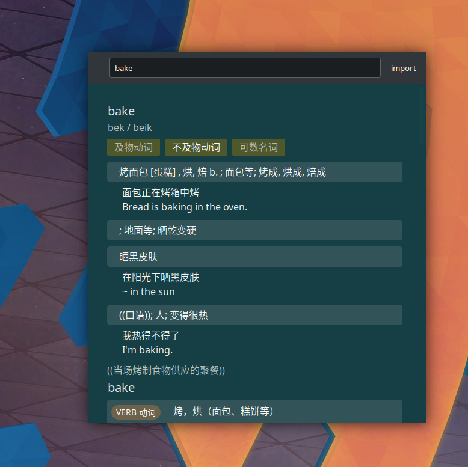

## Offline dictionary with open formats

Totally offline performant dictionary, with prefix fuzzy autocompleting search, live, and clipboard watching.

- Linux only, currently




- A format I camp up with deliberately when cleaning up some dictionary files
    - [x] API server
    - [x] REPL
    - [x] GUI (tauri)

I personally have some Chinese-English dictionary source files. I cleaned up the data into open formats, and this program is specifically for that.

API: 
- `127.0.0.1:3030/q/some_word_to_lookup`
- `/stat/`

Source files that work with it: https://github.com/planetoryd/OpenMdicts

Import them with `offdict yaml -p 'path/OpenMdicts/<wildcard supported>.yaml'`
Then build the index `offdict build`

```sh
apt install libxcb-shape0-dev libxcb-xfixes0-dev # required for building clipboard-master
```

## Usage

- Input anywhere to start live search
- Press ⬆️ or ⬇️ for different words
- Press ⬅️ or ➡️ for scrolling
- It loads `config.json5` in the working directory
- To import dictionaries
    1. Just grab a `data` folder from somewhere (might have vulnerability)
    2. Import with GUI
    3. Import with offdictd

## notes 

- faster fuzzy autocompletion algorithm. https://github.com/qinbill/IncNgTrie ?