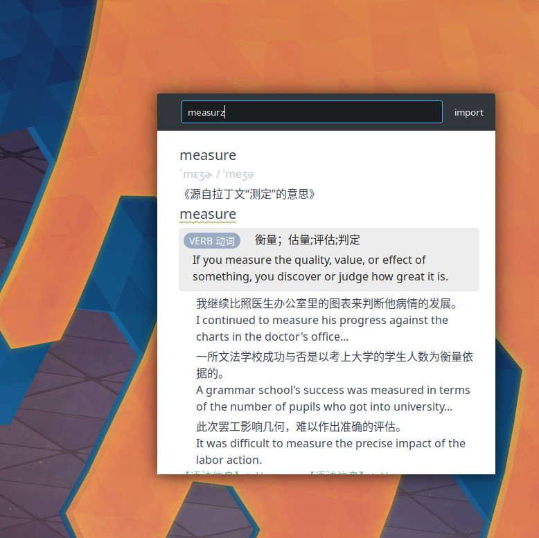
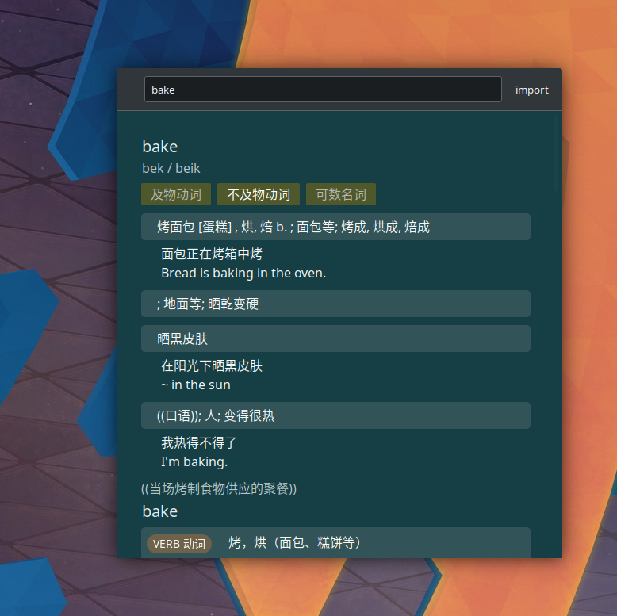

## Offline dictionary with open formats

Totally offline performant dictionary, with prefix fuzzy autocompleting search, live, and clipboard watching (lookup by selection on Linux).

- Linux only, currently




## Usage

- To import dictionaries 
    1. Just grab a `data` folder from somewhere (might have vulnerability)
    2. or, ⚠️**import with 🅰️`./offdict yaml -p '*.yaml'`** ⚠️(supports wildcard `*`) 
    3. ⚠️**Then build the index 🅱️`./offdict build`** ⚠️
- Input anywhere to start live search.
- Copy/select anything to look up.
    1. Tap `ctrl+alt+c` or it won't show up
    2. Select the text, or in some cases, you have to copy it. (explanation below)
- Press ⬅️ or ➡️ for scrolling
- Tap `Enter` to perform an extensive & expensive search
- It loads `config.json5` in the working directory. [example file](config.json5)
- Install [userscript](./offdict-userscript.js) that monitors selection in browsers
    - You have to set the IP of Offdict by changing a variable.

API: 
- `127.0.0.1:3030/q/some_word_to_lookup`
- `/stat/`

```sh
git clone --recurse-submodules <url>
apt install libxcb-shape0-dev libxcb-xfixes0-dev # required for building clipboard-master
```

- Format I camp up with deliberately when cleaning up some dictionary files
    - [x] API server
    - [x] REPL
    - [x] GUI (tauri)

I personally have some Chinese-English dictionary source files. I cleaned up the data into open formats, and this program is specifically for that.

## Known issues

- It may return suboptimal results due to inferior algorithms while I'm trading for speed over accuracy. Better algorithms only exist on papers or are commercial at the time of implementing. 
- IBus seems to write into the PRIMARY of X11 (when I am using Wayland), which was intended to be user selection
- Wayland can't set window on top https://github.com/tauri-apps/tauri/issues/3117 You have to set it manually (temporarily or permanently through system settings)
- Wayland global shortcut https://github.com/tauri-apps/tauri/issues/3578
- IME doesnt work in the input on Wayland 
- Cannot watch clipboard on wayland.

For now GDK_BACKEND=x11 is set by hardcode

- Lookup by selection only works in XWayland windows.
- IBus still messes with Primary (only in windows named 'Chromium Clipboard', like, it doesnt happen in firefox) 
    - [x] workaround: Ignore Chromium Clipboards 
    - The change also propagates to Wayland primary
- Global shortcut `ctrl+alt+c` works

## Todo

- Complete support for 'lookup by copy' and 'lookup by selection'
    - Wayland. Upstream dependecies are not yet working
    - https://github.com/bugaevc/wl-clipboard works
- Lookup by cursor pointing ?
    - Embed it in other applications 


## Notes 

- `cargo tauri build -d -b none`